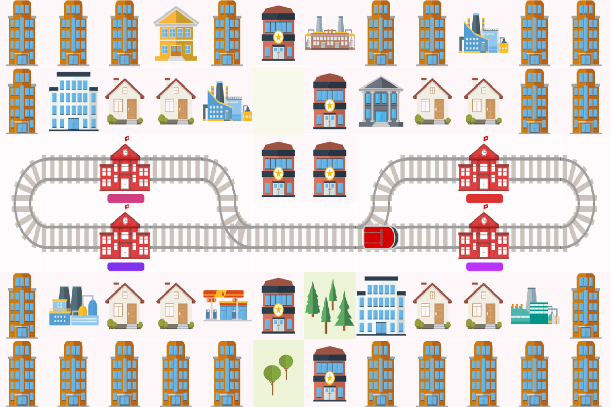
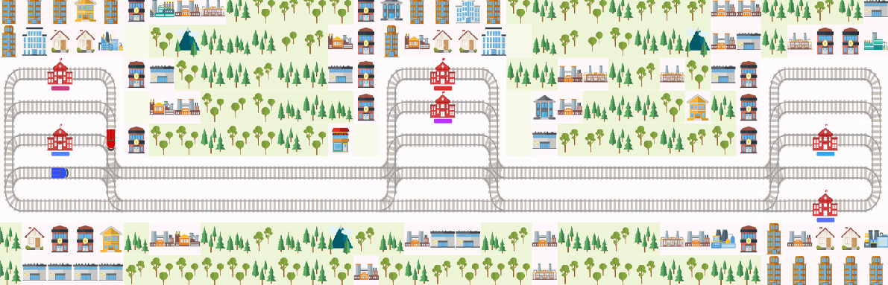
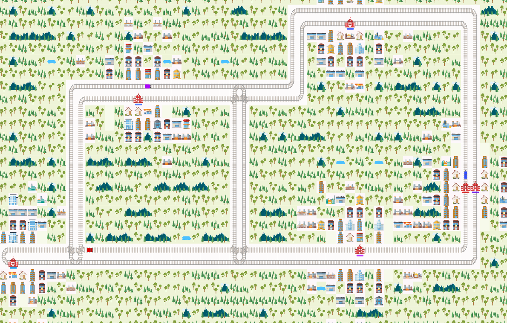

  # Example 1:
  Simple example 2 stations and single rail between them

  # Example 2:
  Simple example 3 stations and double rail between them

  # Example 3:
  Simple example 5 stations and double rail between them

